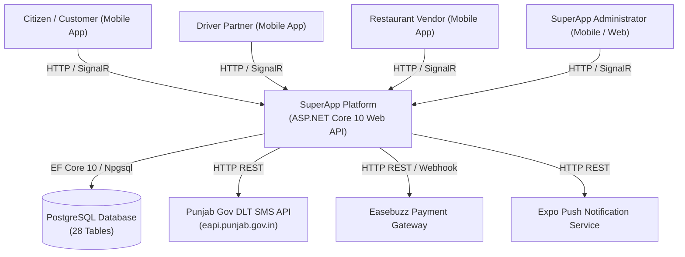
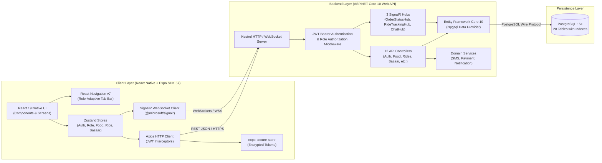
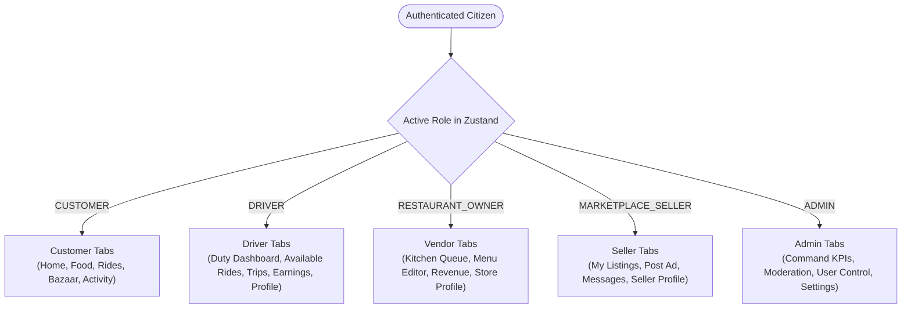
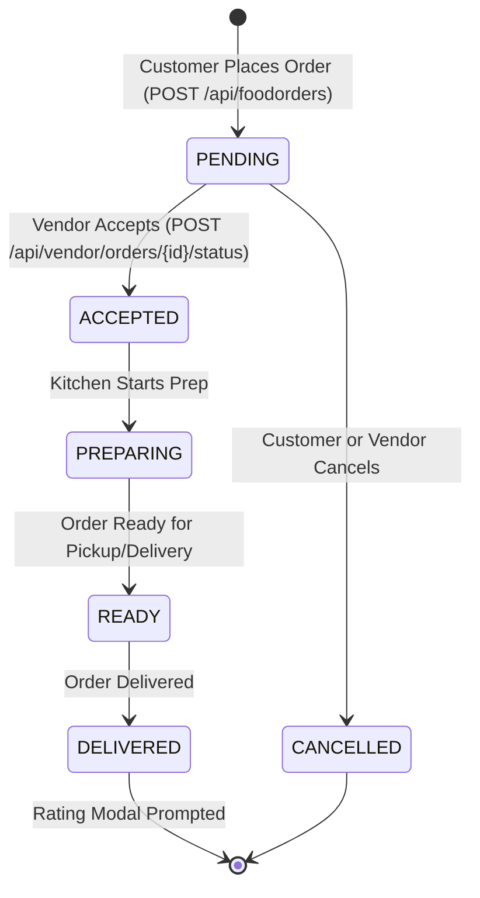
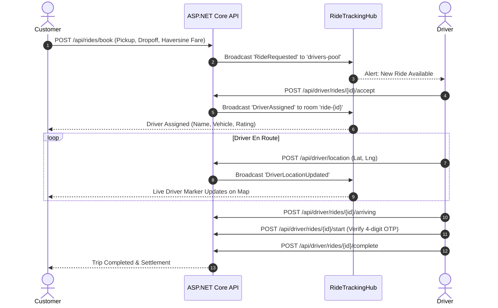

# SuperApp V2 — System Architecture Specification

## 1. Executive Overview

**SuperApp V2** is a unified, hyper-local digital ecosystem tailored for Indian tier-2/3 cities and local commerce. It seamlessly unifies three high-frequency verticals:
1. **🍔 Food Delivery**: Restaurant directory, dynamic menu variants, cart management, coupon redemption, kitchen dispatch, and live delivery tracking.
2. **🚖 Ride Hailing**: Geo-based ride dispatch, Haversine fare estimation across vehicle tiers (Bike, Auto, Cab), OTP-secured trip start, and real-time driver telemetry.
3. **🛍️ Community Bazaar**: P2P classifieds marketplace across 8 categories, listing moderation, buyer-seller chat, and seller ad management.

The entire ecosystem operates on a **Single-Identity Multi-Role Model**, allowing a single citizen user to switch between Customer, Driver, Restaurant Vendor, Marketplace Seller, and Administrator roles with zero session tearing.

---

## 2. Core Architectural Tenets & Zero-Cost Design

A fundamental engineering constraint of SuperApp V2 is **Zero Operational Overhead for Third-Party APIs and Auxiliary Services**:

| Architectural Dimension | Traditional Enterprise Solution | SuperApp V2 Zero-Cost Solution |
|---|---|---|
| **Map & Geocoding APIs** | Google Maps Platform / Mapbox ($5–$10 per 1,000 requests) | Built-in Haversine spherical math calculation engine. Address forms use manual city / state / PIN entry (no external geocoding or postal APIs). |
| **Message Broker / Queue** | RabbitMQ / Apache Kafka / Redis PubSub | ASP.NET Core in-memory SignalR WebSockets with typed group channels (`order-{id}`, `drivers-pool`, `ride-{id}`). |
| **Background Job Scheduler** | Hangfire / Quartz.NET with Redis storage | ASP.NET Core native `IHostedService` / `BackgroundService` with cancellation tokens. |
| **SMS Gateway** | Twilio / AWS SNS / MessageBird ($0.05/SMS) | Direct integration with **Punjab State e-Governance DLT SMS Gateway** (`https://eapi.punjab.gov.in/smapi/sms`) with dev-mode secure fallbacks. |
| **Payment Gateway** | Stripe / Razorpay (with monthly minimums) | Native **Easebuzz Payment Gateway** integration (UPI / NetBanking / Cards) with mock dev fallback. |
| **Database Architecture** | Multi-database polyglot persistence | Single, unified **PostgreSQL** relational database (28 tables) with foreign key indexing, check constraints, and connection pooling. |

---

## 3. High-Level Architecture (C4 Model)

### 3.1 System Context Diagram (C4 Level 1)

### 3.2 Container Diagram (C4 Level 2)

---

## 4. Backend Architecture (.NET 10 Web API)

The backend is structured under `backend/SuperApp.API/` as an enterprise-grade ASP.NET Core 10 Web API:

### 4.1 Target Framework & Core Dependencies
- **Runtime**: .NET 10.0 (`net10.0`), C# 14
- **Web Framework**: ASP.NET Core Web API with Kestrel
- **ORM**: Entity Framework Core 10.0 (`Npgsql.EntityFrameworkCore.PostgreSQL`)
- **Real-Time**: Microsoft.AspNetCore.SignalR
- **Authentication**: `Microsoft.AspNetCore.Authentication.JwtBearer` with HMAC-SHA256
- **Test Framework**: xUnit 2.9, FluentAssertions 8.0, Moq 4.20 (`SuperApp.API.Tests`)

### 4.2 API Controllers (12 Controllers)
1. [`AuthController`](file:///D:/FREELANCER/HTTP-EXPNAT-NET/backend/SuperApp.API/Controllers/AuthController.cs): OTP dispatch (`/send-otp`), verification (`/verify-otp`), profile management (`/profile`), and admin credential login (`/admin-login`).
2. [`BannersController`](file:///D:/FREELANCER/HTTP-EXPNAT-NET/backend/SuperApp.API/Controllers/BannersController.cs): Active promotional banners and discount cards.
3. [`CouponsController`](file:///D:/FREELANCER/HTTP-EXPNAT-NET/backend/SuperApp.API/Controllers/CouponsController.cs): Promo code validation (`WELCOME50`) and discount calculation.
4. [`DriverController`](file:///D:/FREELANCER/HTTP-EXPNAT-NET/backend/SuperApp.API/Controllers/DriverController.cs): Driver profile, duty toggle (`/toggle-online`), ride dispatch pool (`/available-rides`), ride lifecycle actions (`accept`, `arriving`, `start` with OTP, `complete`, `cancel`), GPS telemetry ingestion (`/location`), earnings, and ride history.
5. [`FoodOrdersController`](file:///D:/FREELANCER/HTTP-EXPNAT-NET/backend/SuperApp.API/Controllers/FoodOrdersController.cs): Order placement, item calculation with GST, order cancellation, and customer order history.
6. [`MarketplaceController`](file:///D:/FREELANCER/HTTP-EXPNAT-NET/backend/SuperApp.API/Controllers/MarketplaceController.cs): Bazaar classifieds feed, category catalog, ad publishing, ad moderation/reporting (`/report`), and seller ad management (`/my-listings`, `/toggle-status`).
7. [`NotificationsController`](file:///D:/FREELANCER/HTTP-EXPNAT-NET/backend/SuperApp.API/Controllers/NotificationsController.cs): Device push token registration, notification history, mark as read, and unread badge counting.
8. [`PaymentsController`](file:///D:/FREELANCER/HTTP-EXPNAT-NET/backend/SuperApp.API/Controllers/PaymentsController.cs): Easebuzz transaction initiation, payment verification, webhook capture, and refunds.
9. [`RestaurantsController`](file:///D:/FREELANCER/HTTP-EXPNAT-NET/backend/SuperApp.API/Controllers/RestaurantsController.cs): Restaurant directory search, filtering by veg/rating, detailed menu categories, variants, and addons.
10. [`RidesController`](file:///D:/FREELANCER/HTTP-EXPNAT-NET/backend/SuperApp.API/Controllers/RidesController.cs): Haversine distance and fare estimation, ride booking, cancellation, and customer ride history.
11. [`ReviewsController`](file:///D:/FREELANCER/HTTP-EXPNAT-NET/backend/SuperApp.API/Controllers/ReviewsController.cs): Unified reviews and 1–5 star ratings for restaurants, drivers, and marketplace sellers with automatic rolling average calculation.
12. [`VendorController`](file:///D:/FREELANCER/HTTP-EXPNAT-NET/backend/SuperApp.API/Controllers/VendorController.cs): Restaurant vendor order queue, state transitions (`PENDING` -> `ACCEPTED` -> `PREPARING` -> `READY` -> `DELIVERED`), menu CRUD, category actions, store availability toggle, and revenue settlement.
13. [`AdminController`](file:///D:/FREELANCER/HTTP-EXPNAT-NET/backend/SuperApp.API/Controllers/AdminController.cs): Platform dashboard metrics, user suspension management, restaurant approval/status, ride overview, listing moderation, and system settings.

### 4.3 SignalR WebSocket Hubs
- **`OrderStatusHub` (`/hubs/order`)**:
  - Groups: `order-{orderId}`, `vendor-{restaurantId}`.
  - Events: `OrderStatusUpdated`, `NewOrderAlert`, `OrderCancelled`.
- **`RideTrackingHub` (`/hubs/ride`)**:
  - Groups: `drivers-pool`, `ride-{rideId}`.
  - Events: `RideRequested`, `DriverAssigned`, `DriverLocationUpdated`, `RideStatusChanged`.
- **`ChatHub` (`/hubs/chat`)**:
  - Groups: `conversation-{id}`.
  - Events: `ReceiveMessage`, `MessageRead`.

---

## 5. Frontend Architecture (React Native + Expo SDK 57)

### 5.1 Technology Foundation
- **Framework**: React Native 0.86.3 / Expo SDK ~57.0.24 (New Architecture ready)
- **Language**: TypeScript ~6.0.3 (Strict mode)
- **UI Library**: React 19.2.3 with styled component tokens (`src/theme/colors.ts`, `spacing.ts`)
- **Routing**: React Navigation v7 with Native Stack & Dynamic Bottom Tab Navigator
- **State Store**: Zustand 5.0.15 with lightweight decoupled slices

### 5.2 State Management Architecture
The client stores are isolated by concern and communicate through typed contracts:
- `authStore`: User profile, JWT Bearer token, session initialization, and logout.
- `roleStore`: Active role selection, available roles, role validation, and persistence via `AsyncStorage`.
- `foodStore`: Restaurant listings, menu cache, cart state with tax/delivery logic, active order tracking.
- `rideStore`: Current coordinates, destination, fare estimates, active ride tracking, and driver telemetry.
- `marketplaceStore`: Classifieds listings, category filter, active ad publishing state.
- `notificationStore`: Unread count, notification inbox, and push permission state.

### 5.3 Dynamic Navigation & Role-Adaptive Tab Bar
The application utilizes a single root navigator [`MainTabNavigator.tsx`](file:///D:/FREELANCER/HTTP-EXPNAT-NET/src/navigation/MainTabNavigator.tsx) that inspects `useRoleStore.getState().activeRole` and dynamically mounts the appropriate bottom navigation bar:

---

## 6. Real-Time Communication & State Machines

### 6.1 Food Order State Machine

At every state transition, `OrderStatusHub` broadcasts `OrderStatusUpdated` over WebSocket room `order-{id}`, causing the customer tracking stepper to update instantaneously without polling.

### 6.2 Ride Hailing Lifecycle

---

## 7. Address Entry (Manual)

Saved address forms collect house/street, optional landmark, city, state, and 6-digit PIN as plain text fields. There is no client or server postal lookup API, so city and state are entered manually by the user.

---

## 8. Witty Notification Catalog

To drive high customer engagement without marketing tooling costs, the notification subsystem includes an intelligent localized witty copy generator:
- **Categories**: Food Delivery, Ride Status, Marketplace Inquiries, System Promos.
- **Tone**: Playful, culturally relatable Indian context (e.g., *"Garam garam khana is on its way!"*, *"Driver bhaiya is waiting at your gate! Don't make him wait!"*).
- **Delivery**: Dispatched via local device scheduling (`expo-notifications`) and Expo Push API.

---

## 9. Security & Hardening Architecture

1. **Authentication**: JWT Bearer tokens signed with HMAC-SHA256 (256-bit secret key).
2. **Encrypted Storage**: Client-side storage of auth tokens, active role, and refresh keys via Android Keystore / iOS Keychain (`expo-secure-store`).
3. **Database Security**:
   - Zero plaintext passwords: PBKDF2 with HMAC-SHA256 hashing.
   - Foreign key cascading rules and strict `CHECK` constraints on status enums.
   - Non-root database credentials via connection string pooling.
4. **CORS & Network Policies**:
   - Strict CORS origins configured in ASP.NET Core `Program.cs`.
   - Rate limiting and size limits enforced on multipart binary upload endpoints.
