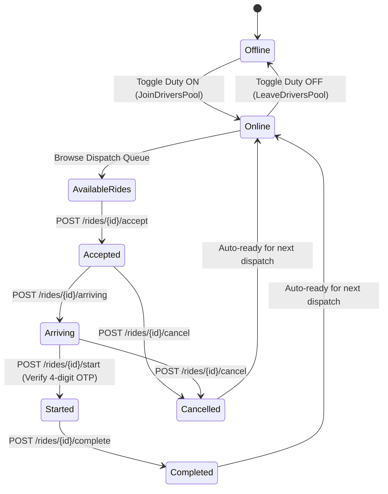

# Driver Mode — Specifications & Real Implementation

## 1. Overview

Driver Mode enables registered fleet operators and partner drivers to receive, navigate, and complete ride requests directly inside the primary SuperApp mobile client. It replaces third-party driver apps with a unified, native React Native + Expo experience backed by ASP.NET Core and SignalR.

---

## 2. Driver State Machine & Trip Lifecycle

### Step-by-Step Lifecycle
1. **Duty Toggle**:
   - When offline, driver cannot receive dispatch broadcasts.
   - Turning on duty (`POST /api/driver/toggle-online`) registers the driver in the active pool and connects to `RideTrackingHub.JoinDriversPool()`.
2. **Available Rides Dispatch**:
   - `GET /api/driver/available-rides` queries all pending rides within dispatch range with status `SEARCHING`.
   - Driver reviews pickup, drop-off, estimated fare, and customer details.
3. **Ride Acceptance**:
   - Driver clicks **Accept Ride**.
   - `POST /api/driver/rides/{id}/accept` assigns the driver to the ride record in Supabase and updates status to `ACCEPTED`.
   - SignalR broadcasts `RideStatusChanged` to the customer's active tracking screen.
4. **Arriving at Pickup**:
   - Driver taps **Arrived at Pickup**.
   - `POST /api/driver/rides/{id}/arriving` updates status to `ARRIVING` and alerts the waiting passenger.
5. **OTP Verification & Trip Start**:
   - Passenger shares the secret 4-digit OTP displayed on their screen.
   - Driver enters the OTP in `DriverHomeScreen`.
   - `POST /api/driver/rides/{id}/start` verifies the OTP against `Rides.OtpCode` on the backend.
   - If valid, the trip transitions to `STARTED`. If invalid, an error alert prevents unauthorized trip departure.
6. **Trip Completion & Earnings**:
   - Upon arriving at the drop-off destination, driver taps **Complete Trip**.
   - `POST /api/driver/rides/{id}/complete` settles the trip, updates driver's total ride counter and earnings, and resets driver status back to available.

---

## 3. Battery-Conscious Foreground GPS Telemetry

To minimize battery drain and avoid excessive API bandwidth:
1. **Conditional Activation**:
   - Telemetry watcher (`locationService.watchLocation`) starts **only** when driver is `Online` **and** actively in a trip (`ACCEPTED`, `ARRIVING`, `STARTED`).
   - If offline or idling without a ride, GPS tracking remains stopped.
2. **Interval Throttling**:
   - Configured with `distanceInterval: 10` (10 meters) and `timeInterval: 5000` (5 seconds).
3. **Backend & SignalR Relay**:
   - Coordinates are posted to `POST /api/driver/location`.
   - `DriverController` updates `Drivers.CurrentLatitude/Longitude` and triggers `RideTrackingHub.Clients.Group($"ride_{rideId}").SendAsync("DriverLocationUpdated", ...)`.
   - The passenger's `ActiveRideScreen` smoothly receives real-time coordinate updates over WebSockets.

---

## 4. Driver API Endpoints

| Method | Endpoint | Description | Auth Roles |
|--------|----------|-------------|------------|
| `GET` | `/api/driver/profile` | Driver bio, verification status, rating, vehicle details | `DRIVER`, `ADMIN` |
| `POST` | `/api/driver/toggle-online` | Toggle duty between online and offline | `DRIVER`, `ADMIN` |
| `GET` | `/api/driver/available-rides` | Fetch available pending ride requests | `DRIVER`, `ADMIN` |
| `GET` | `/api/driver/active-ride` | Fetch driver's current in-progress ride | `DRIVER`, `ADMIN` |
| `POST` | `/api/driver/rides/{id}/accept` | Accept a dispatched ride request | `DRIVER`, `ADMIN` |
| `POST` | `/api/driver/rides/{id}/arriving` | Signal driver arrival at pickup point | `DRIVER`, `ADMIN` |
| `POST` | `/api/driver/rides/{id}/start` | Start ride with customer 4-digit OTP | `DRIVER`, `ADMIN` |
| `POST` | `/api/driver/rides/{id}/complete` | Mark trip completed and credit earnings | `DRIVER`, `ADMIN` |
| `POST` | `/api/driver/rides/{id}/cancel` | Cancel active ride with reason | `DRIVER`, `ADMIN` |
| `POST` | `/api/driver/location` | Stream vehicle GPS telemetry | `DRIVER`, `ADMIN` |
| `GET` | `/api/driver/history` | List of past completed & cancelled trips | `DRIVER`, `ADMIN` |
| `GET` | `/api/driver/earnings` | Daily, weekly, total revenue & trip counters | `DRIVER`, `ADMIN` |

---

## 5. UI & Screen Architecture

- **`DriverHomeScreen`** (`src/features/driver/DriverHomeScreen.tsx`):
  - Online/Offline duty toggle switch hero banner.
  - Active trip card with live status badges (`ACCEPTED`, `ARRIVING`, `STARTED`).
  - Passenger contact call button and pickup/drop-off directions.
  - 4-digit OTP input form with validation.
  - Available rides list with 1-tap accept button.
- **`DriverRidesScreen`** (`src/features/driver/DriverRidesScreen.tsx`):
  - Trip history tab with filter by Completed / Cancelled.
  - Fare breakdown, timestamp, ride reference number, and addresses.
- **`DriverEarningsScreen`** (`src/features/driver/DriverEarningsScreen.tsx`):
  - KPI summary cards: Today's Earnings, Weekly Earnings, Total Revenue, Total Rides.
  - Vehicle details card: Make, model, plate registration number, color.
