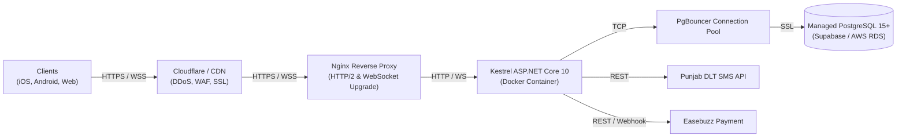

# SuperApp V2 — Production Setup & Deployment Manual

This document defines the production deployment, infrastructure architecture, external gateway configuration, and security hardening procedures for **SuperApp V2**.

---

## 1. Production Architecture Overview

In a production environment, the backend runs as a containerized ASP.NET Core 10 Web API behind a reverse proxy (Nginx or Cloudflare) with TLS 1.3 termination, while the database connects to a pooled PostgreSQL 15+ instance:



---

## 2. Docker Containerization (.NET 10 API)

### 2.1 Multi-Stage Production `Dockerfile`
Create `backend/SuperApp.API/Dockerfile`:

```dockerfile
# Stage 1: Build & Publish
FROM mcr.microsoft.com/dotnet/sdk:10.0 AS build
WORKDIR /src

COPY ["backend/SuperApp.API/SuperApp.API.csproj", "SuperApp.API/"]
RUN dotnet restore "SuperApp.API/SuperApp.API.csproj"

COPY backend/SuperApp.API/ SuperApp.API/
WORKDIR "/src/SuperApp.API"
RUN dotnet publish "SuperApp.API.csproj" -c Release -o /app/publish /p:UseAppHost=false

# Stage 2: Production Runtime
FROM mcr.microsoft.com/dotnet/aspnet:10.0 AS runtime
WORKDIR /app
EXPOSE 5000
ENV ASPNETCORE_URLS=http://+:5000
ENV ASPNETCORE_ENVIRONMENT=Production

# Security: Run as non-root user
USER app
COPY --from=build /app/publish .

ENTRYPOINT ["dotnet", "SuperApp.API.dll"]
```

### 2.2 Docker Compose (`docker-compose.prod.yml`)
```yaml
version: '3.8'

services:
  api:
    build:
      context: .
      dockerfile: backend/SuperApp.API/Dockerfile
    restart: always
    environment:
      - ASPNETCORE_ENVIRONMENT=Production
      - ConnectionStrings__DefaultConnection=${PROD_DB_CONNECTION}
      - JwtSettings__SecretKey=${PROD_JWT_SECRET}
      - Easebuzz__MerchantKey=${EASEBUZZ_KEY}
      - Easebuzz__Salt=${EASEBUZZ_SALT}
      - Easebuzz__Environment=prod
      - SmsSettings__ApiKey=${DLT_SMS_API_KEY}
    ports:
      - "5000:5000"
    healthcheck:
      test: ["CMD", "curl", "-f", "http://localhost:5000/health"]
      interval: 30s
      timeout: 10s
      retries: 3
```

---

## 3. Reverse Proxy & SignalR WebSocket Configuration (Nginx)

SignalR requires sticky WebSocket upgrades and persistent connections. Configure your Nginx virtual host as follows:

```nginx
map $http_upgrade $connection_upgrade {
    default upgrade;
    '' close;
}

server {
    listen 443 ssl http2;
    server_name api.superapp.domain.com;

    ssl_certificate /etc/letsencrypt/live/api.superapp.domain.com/fullchain.pem;
    ssl_certificate_key /etc/letsencrypt/live/api.superapp.domain.com/privkey.pem;
    ssl_protocols TLSv1.2 TLSv1.3;
    ssl_ciphers HIGH:!aNULL:!MD5;

    # Security Headers
    add_header X-Frame-Options DENY always;
    add_header X-Content-Type-Options nosniff always;
    add_header X-XSS-Protection "1; mode=block" always;
    add_header Strict-Transport-Security "max-age=31536000; includeSubDomains" always;

    # REST API & Health Checks
    location / {
        proxy_pass http://localhost:5000;
        proxy_http_version 1.1;
        proxy_set_header Host $host;
        proxy_set_header X-Real-IP $remote_addr;
        proxy_set_header X-Forwarded-For $proxy_add_x_forwarded_for;
        proxy_set_header X-Forwarded-Proto $scheme;
        proxy_cache_bypass $http_upgrade;
    }

    # SignalR Real-Time WebSockets
    location ~* ^/hubs/ {
        proxy_pass http://localhost:5000;
        proxy_http_version 1.1;
        proxy_set_header Upgrade $http_upgrade;
        proxy_set_header Connection $connection_upgrade;
        proxy_set_header Host $host;
        proxy_cache_bypass $http_upgrade;
        proxy_read_timeout 300s;
        proxy_send_timeout 300s;
    }
}
```

---

## 4. Production Gateway Integrations

### 4.1 Punjab State e-Governance DLT SMS Gateway
The SMS integration communicates directly with the Punjab government API:
- **Base URL**: `https://eapi.punjab.gov.in/smapi/sms`
- **Template ID**: `1407177633307627182`
- **Production Setting**: In `appsettings.Production.json`, ensure `EnableMasterOtpFallback` is set to `false`. Every OTP must be dispatched and validated via the live DLT gateway.

### 4.2 Easebuzz Payment Gateway
- **Merchant Key & Salt**: Provisioned in Easebuzz Merchant Dashboard.
- **Environment**: Set `Easebuzz:Environment` to `prod`.
- **Webhook Endpoint**: Register `https://api.superapp.domain.com/api/payments/webhook` with HMAC verification.

---

## 5. Mobile App Production Build Pipeline (Expo EAS)

The customer and driver mobile application is built using Expo Application Services (EAS):

### 5.1 EAS Build Configuration (`eas.json`)
```json
{
  "cli": {
    "version": ">= 12.0.0"
  },
  "build": {
    "production": {
      "channel": "production",
      "env": {
        "EXPO_PUBLIC_API_URL": "https://api.superapp.domain.com/api",
        "EXPO_PUBLIC_SIGNALR_URL": "https://api.superapp.domain.com",
        "EXPO_PUBLIC_ENV": "production"
      },
      "android": {
        "buildType": "app-bundle"
      },
      "ios": {
        "simulator": false
      }
    }
  }
}
```

### 5.2 Building for App Stores
```bash
# Authenticate with EAS
npx eas login

# Build Android App Bundle (.aab) for Google Play
npx eas build --platform android --profile production

# Build iOS Archive (.ipa) for App Store / TestFlight
npx eas build --platform ios --profile production

# Submit directly to Google Play
npx eas submit -p android --latest
```

---

## 6. Database Connection Pooling & Maintenance

- **Connection Pool**: Supabase Transaction Pooler (Port `6543`) with PgBouncer.
- **Max Connections**: Set `Maximum Pool Size=50;Minimum Pool Size=5;Connection Lifetime=300;` in the Npgsql connection string.
- **Automated Backups**: Enable Daily WAL archiving and 7-day point-in-time recovery (PITR).
- **Migration Protocol**: Run migrations during scheduled maintenance windows using `database/migrations/`. Never run destructive DDL (`DROP TABLE`, `TRUNCATE`) in production.
