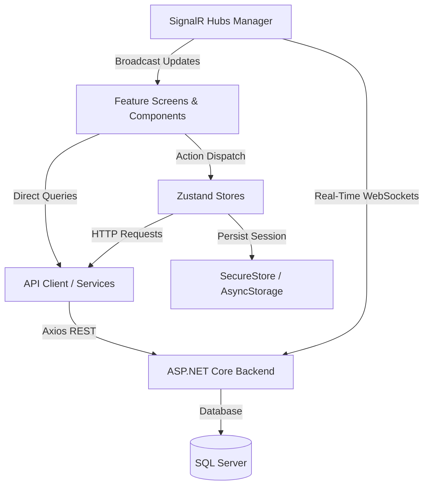

# React Native + Expo Architecture Documentation

This document outlines the architecture, directory layout, design patterns, and layer responsibilities of the React Native + Expo mobile application (`D:\FREELANCER\HTTP-EXPNAT-NET`).

---

## 1. Directory Structure

```
HTTP-EXPNAT-NET/
├── .env.example                     # Environment template (git committed)
├── .gitignore                       # Node, Expo, and secrets exclusion patterns
├── App.tsx                          # Application root, theme context, and navigation container
├── app.json                         # Expo configuration (bundle identifier, slug, splash, orientation)
├── package.json                     # Dependencies and npm scripts
├── tsconfig.json                    # Strict TypeScript configuration
├── docs/                            # Comprehensive migration and technical documentation
│   ├── REACT_NATIVE_MIGRATION.md
│   ├── REACT_NATIVE_ARCHITECTURE.md
│   ├── REACT_NATIVE_CONFIGURATION.md
│   ├── REACT_NATIVE_SCREEN_MAPPING.md
│   ├── REACT_NATIVE_API_MAPPING.md
│   ├── REACT_NATIVE_STATUS.md
│   └── CHANGELOG.md
└── src/
    ├── config/                      # Environment-driven configuration
    │   └── environment.ts           # Dynamic API & SignalR endpoint resolver
    ├── constants/                   # Static app & route constants
    │   ├── api.ts                   # Backend endpoints & hub paths
    │   ├── app.ts                   # Global timeouts, currency symbol, dev OTP
    │   └── index.ts
    ├── theme/                       # Design tokens and styles
    │   ├── colors.ts                # Primary, secondary, module, status colors
    │   ├── typography.ts            # Text hierarchy (h1, h2, h3, body, caption)
    │   ├── spacing.ts               # 8pt scale & border radiuses
    │   └── index.ts
    ├── models/                      # TypeScript DTOs & Domain Models
    │   ├── common.ts                # ApiResponse, PagedResult
    │   ├── auth.ts                  # User, Token, OTP DTOs
    │   ├── food.ts                  # Restaurant, FoodItem, CartItem, Order
    │   ├── ride.ts                  # VehicleEstimate, Driver, BookRide, Ride
    │   ├── marketplace.ts           # Category, ListingSummary, ListingDetail
    │   └── index.ts
    ├── services/                    # API clients, SignalR, & device interfaces
    │   ├── apiClient.ts             # Axios client with JWT bearer interceptors
    │   ├── storage.ts               # SecureStore (mobile) & AsyncStorage (web fallback)
    │   ├── signalr.ts               # SignalR connection manager (Rides, Orders, Chat)
    │   ├── locationService.ts       # Haversine distance & ETA calculator
    │   ├── paymentService.ts        # Payment processing simulator
    │   ├── notificationService.ts   # In-app event emitter / notification dispatcher
    │   └── index.ts
    ├── store/                       # Client state management (Zustand)
    │   ├── authStore.ts             # Authentication, session, token persistence
    │   ├── cartStore.ts             # Food basket, taxes, discounts, checkout
    │   ├── marketplaceStore.ts      # Custom user ads & saved favorites
    │   └── index.ts
    ├── components/
    │   └── common/                  # Reusable UI widgets
    │       ├── AppButton.tsx        # Styled button with loading state
    │       ├── AppSearchBar.tsx     # Reusable search bar with clear button
    │       ├── RatingBadge.tsx      # Green rating pill
    │       ├── VegBadge.tsx         # Veg / Non-Veg square indicator
    │       ├── StatusBadge.tsx      # Order and ride status chips
    │       ├── PriceDisplay.tsx     # Formatted price with strikethrough discount
    │       ├── EmptyState.tsx       # Placeholder when lists are empty
    │       └── index.ts
    ├── features/                    # Feature-based screen modules
    │   ├── splash/                  # SplashScreen
    │   ├── auth/                    # PhoneEntryScreen, OtpVerificationScreen
    │   ├── home/                    # HomeScreen
    │   ├── food/                    # FoodHomeScreen, RestaurantDetailScreen,
    │   │                            # FoodOrderTrackingScreen, ItemCustomizationSheet,
    │   │                            # CartSummarySheet
    │   ├── ride/                    # RideBookingScreen, ActiveRideScreen
    │   ├── marketplace/             # MarketplaceHomeScreen, ListingDetailScreen,
    │   │                            # AddListingScreen
    │   ├── profile/                 # ProfileScreen
    │   ├── notifications/           # NotificationsScreen
    │   └── activity/                # ActivityScreen (3 tabs)
    └── navigation/                  # Navigation definitions
        ├── types.ts                 # Type-safe parameter lists
        ├── MainTabNavigator.tsx     # 4 bottom tabs
        └── RootNavigator.tsx        # Stack navigator
```

---

## 2. Layer Responsibilities & Data Flow



### A. Presentation Layer (`src/features/` and `src/components/`)
- Pure functional React Native components using TypeScript.
- Styled using standard `StyleSheet.create` with semantic tokens from `src/theme/`.
- Screen transitions and routing handled through React Navigation v7 with strict parameter typing (`RootStackParamList`, `MainTabParamList`).

### B. State Layer (`src/store/`)
- Minimalist, performant Zustand stores without boilerplate.
- `authStore`: Automatically loads persisted JWT tokens on app boot and configures the Axios default header.
- `cartStore`: Real-time reactive cart state computing Subtotal, 5% GST, and Grand Total.
- `marketplaceStore`: Manages local ad listings and favorite bookmark IDs.

### C. Network & Communication Layer (`src/services/`)
- **HTTP Client**: Axios instance configured with request interceptors to append `Authorization: Bearer <token>`, handle timeouts (15s default), and normalize API responses into typed `ApiResponse<T>`.
- **SignalR Real-Time**: `@microsoft/signalr` `HubConnection` management for live driver telemetry (`/hubs/ride`), food delivery stages (`/hubs/order`), and customer-seller chat (`/hubs/chat`).
- **Offline Data Fallbacks**: When HTTP calls fail or during offline demos, screens seamlessly fall back to the built-in seed datasets that match the Flutter production seed data.
