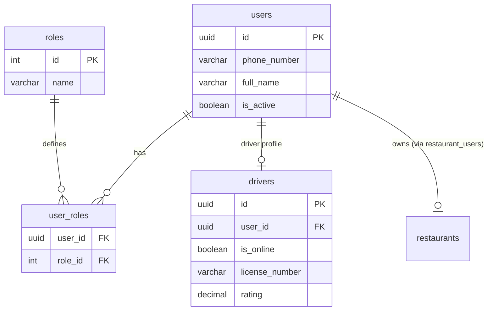
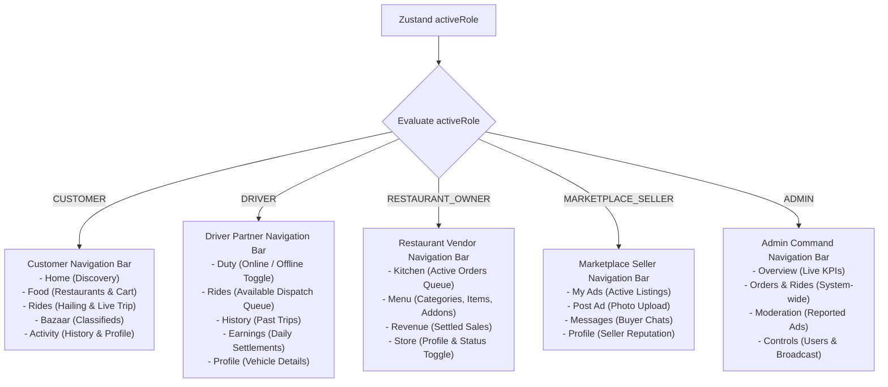

# SuperApp V2 — Roles & Permissions Specification

## 1. Single-Identity Multi-Role Architecture

In traditional multi-sided platforms, drivers, merchants, and customers are forced to maintain separate user accounts, install separate apps (e.g., Uber vs. Uber Driver, Swiggy vs. Swiggy Partner), or perform tedious re-logins. 

**SuperApp V2** eliminates this friction through a **Single-Identity Multi-Role Model**:
- **Single User Account**: A citizen signs up once using their verified mobile number.
- **Relational Role Bindings**: The user's single identity (`users.id`) is mapped to one or more roles via the `user_roles` join table in PostgreSQL.
- **Unified JWT Claims**: Upon OTP verification, the ASP.NET Core backend generates a JWT token embedding all assigned roles into the role claims array.
- **Seamless In-App Role Switching**: The client application dynamically updates its theme, bottom navigation tabs, and reachable routes according to the currently active role without logging the user out.

---

## 2. The 5 Core Roles

| Role Key | Description | Capabilities | Default Landing View |
|---|---|---|---|
| `CUSTOMER` | Default citizen role assigned to every registered phone number. | Browse food menus, place orders, book rides, browse classified ads, submit reviews, make payments. | `HomeScreen` (Discovery) |
| `DRIVER` | Verified vehicle driver partner. | Toggle online/offline duty, receive incoming ride dispatches, accept rides, verify passenger OTP, stream GPS coordinates, track earnings. | `DriverDutyScreen` |
| `RESTAURANT_OWNER` | Restaurant manager or vendor partner. | View kitchen order queue, advance order states (`PENDING` -> `ACCEPTED` -> `PREPARING` -> `READY`), edit menu items & prices, toggle store open/close, view revenue. | `VendorOrdersScreen` |
| `MARKETPLACE_SELLER`| Verified classifieds seller. | Post new ads with photos and condition ratings, mark listings as sold, manage inventory, chat with prospective buyers. | `SellerDashboardScreen` |
| `ADMIN` | Platform operator and system administrator. | Platform KPI dashboard, manage user suspension, approve restaurants, moderate reported listings, broadcast push notifications. | `AdminDashboardScreen` |

---

## 3. Database Schema Mapping



### Pre-Configured Test Personas
For integration and automated testing, the database is seeded with two multi-role identities:
- **Citizen / Operator (`6375002348`)**: Assigned `CUSTOMER`, `DRIVER`, `RESTAURANT_OWNER`, `MARKETPLACE_SELLER`.
- **System Administrator (`9999999999`)**: Assigned `ADMIN`, `CUSTOMER`.

---

## 4. Frontend Role Management (`useRoleStore`)

Client-side role state is managed in [`src/store/roleStore.ts`](file:///D:/FREELANCER/HTTP-EXPNAT-NET/src/store/roleStore.ts) using Zustand:

```typescript
export interface RoleState {
  activeRole: UserRole;
  availableRoles: UserRole[];
  hasMultipleRoles: boolean;
  setRoles: (roles: string[]) => void;
  switchRole: (role: UserRole) => boolean;
  clearRoles: () => void;
}
```

### 4.1 Role Normalization
Heterogeneous backend role representations (`"Customer"`, `"CUSTOMER"`, `"driver"`, `"ROLE_DRIVER"`) are sanitized and mapped into the strict TypeScript union:
```typescript
export type UserRole = 'CUSTOMER' | 'DRIVER' | 'RESTAURANT_OWNER' | 'MARKETPLACE_SELLER' | 'ADMIN';
```

### 4.2 Security Guards in Role Switching
When a user attempts to switch roles via `switchRole(targetRole)`:
1. The store checks if `availableRoles.includes(targetRole)`.
2. **If Authorized**: `activeRole` is updated, persisted to `AsyncStorage` (`superapp_active_role`), and returns `true`.
3. **If Unauthorized** (e.g., a customer trying to switch to `ADMIN`): The switch is rejected, the state remains guarded, and returns `false`.

### 4.3 Persistence Across Reboots
When the mobile application boots or rehydrates:
1. `authStore.checkAuth()` loads the JWT and user profile from `expo-secure-store`.
2. The user's server-verified roles are populated into `availableRoles`.
3. The stored `superapp_active_role` is read from `AsyncStorage`. If valid and present in `availableRoles`, it is restored; otherwise, it falls back safely to `CUSTOMER`.

---

## 5. Dynamic Navigation Adaptation (`MainTabNavigator`)

[`MainTabNavigator.tsx`](file:///D:/FREELANCER/HTTP-EXPNAT-NET/src/navigation/MainTabNavigator.tsx) dynamically mounts the appropriate bottom navigation bar based on `activeRole`:



---

## 6. Server-Side Authorization & Enforcement

Client-side role switching only governs UI navigation; **all security boundaries are strictly enforced on the server**:

### 6.1 ASP.NET Core Role Filters
Controllers and actions are annotated with declarative `[Authorize(Roles = "...")]` attributes:
- `DriverController`: `[Authorize(Roles = "DRIVER")]`
- `VendorController`: `[Authorize(Roles = "RESTAURANT_OWNER")]`
- `AdminController`: `[Authorize(Roles = "ADMIN")]`

### 6.2 Negative Security Test Matrix (Automated UAT)
The test suite explicitly verifies authorization boundaries:

| Test Code | Scenario Description | Tested Role | Target Endpoint | Expected Result | Status |
|---|---|---|---|:---:|:---:|
| `SEC-01` | Unauthorized request without JWT Bearer header | Unauthenticated | `GET /api/auth/profile` | `401 Unauthorized` | **PASS** |
| `SEC-02` | Driver API accessed by Customer | `CUSTOMER` | `POST /api/driver/toggle-online` | `403 Forbidden` | **PASS** |
| `SEC-03` | Admin Command accessed by Driver | `DRIVER` | `GET /api/admin/dashboard` | `403 Forbidden` | **PASS** |
| `SEC-04` | Restaurant Vendor API accessed by Customer | `CUSTOMER` | `POST /api/vendor/orders/1/status` | `403 Forbidden` | **PASS** |
| `SEC-05` | Unauthorized Role Switch on Client | `CUSTOMER` | Attempt switch to `ADMIN` | Rejected (State Preserved) | **PASS** |
