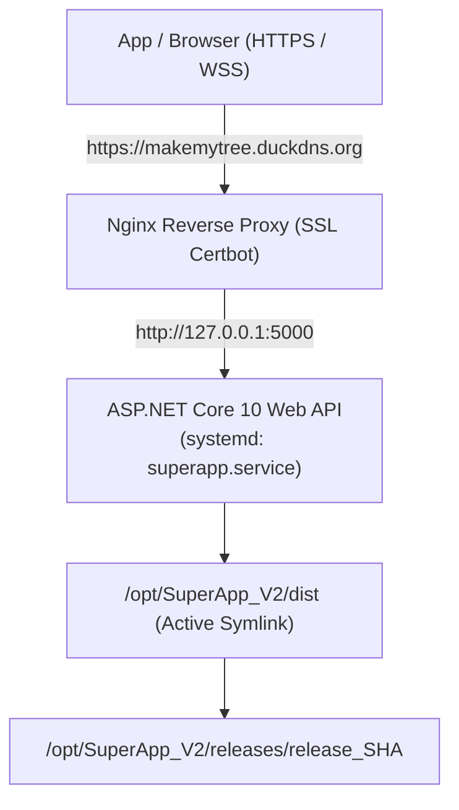

# SuperApp V2 — Production Auto-Deployment & Rollback Guide

Bhai, yeh document aapke server deployment, auto-update pipeline, aur rollback system ka complete user guide hai. Isme humne sabhi steps detail me likhe hain taaki aap asani se samajh sakein ki background me kya ho raha hai aur aapko kya karna hai.

---

## 📌 1. Server Architecture & Ground Truth

Aapke Azure server par backend is tarah chal raha hai:



### Pehle Code Update Kyun Nahi Ho Raha Tha?
- Aap server par jakar sirf `git pull` karte the. `git pull` se sirf raw C# `.cs` files download hoti theen.
- Lekin `superapp.service` code ko `/opt/SuperApp_V2/dist` folder se chala raha tha.
- Jab tak `dotnet publish` command run na ho aur `systemctl restart superapp` na kiya jaye, naya code chal hi nahi sakta tha.

---

## 🚀 2. Fully Automated Pipeline (Kaise Kaam Karega)

Ab humne **100% Zero-Touch Automation** setup kar diya hai:

1. **Aap Local PC se Code Push karenge:**
   ```bash
   git add .
   git commit -m "feat: new changes"
   git push origin main
   ```
2. **GitHub Actions Auto-Run hoga (`.github/workflows/deploy.yml`):**
   - Sabse pehle automated tests chalenge (`dotnet test`, `npx tsc --noEmit`, `npm test`).
   - Agar kisi code me error hai, to deployment **turant ruk jayegi** — server par koi bhi broken code nahi jayega!
3. **VM par Automatic SSH Execution:**
   - Tests pass hote hi GitHub Actions aapke Azure server (`20.106.173.109`) se connect karega.
   - Script run karega: `sudo ./scripts/manage.sh deploy v-<commitSHA>`.
4. **Zero-Downtime Deployment & Health Probe:**
   - Server code pull karega aur ek naye versioned folder `/opt/SuperApp_V2/releases/release_<SHA>` me publish karega.
   - `/opt/SuperApp_V2/dist` ko naye release folder par point karke `superapp.service` restart kar dega.
   - Script 30 seconds tak `http://127.0.0.1:5000/health` ko probe karega.
5. **Auto-Rollback on Error (Protection):**
   - Agar naye code me koi fatal crash ya database error aati hai aur healthcheck fail hota hai:
   - System **automatically pichle working release par rollback kar dega**!
   - Server down nahi hoga aur purana code chalta rahega!
6. **Automatic Disk Cleanup:**
   - Script latest 5 releases ko rakhega aur purani releases ko delete kar dega taaki server ki hard disk kabhi full na ho.

---

## 🔑 3. One-Time Setup: GitHub Secrets Kaise Add Karein

GitHub Actions ko server se securely connect karne ke liye aapko GitHub repository me 3 secrets add karne hain:

### Steps:
1. Apne GitHub repository me jayein: `Settings` tab par click karein.
2. Left sidebar me `Secrets and variables` -> `Actions` par click karein.
3. `New repository secret` button dabayein aur yeh 3 secrets banayein:

| Secret Name | Value | Description |
|---|---|---|
| **`VM_HOST`** | `20.106.173.109` | Azure VM ka Public IP |
| **`VM_USER`** | `azureuser` | Server username |
| **`VM_SSH_KEY`** | Content of `rockbuilder_key.pem` | Aapki Private SSH Key (Neeche dekhein) |

> [!TIP]
> **SSH Key Copy karne ka tarika:**
> Apne local computer par PowerShell me yeh command chalayein:
> ```powershell
> Get-Content C:\Users\admin\.ssh\rockbuilder_key.pem | Set-Clipboard
> ```
> Isse aapki key clipboard me copy ho jayegi. Fir GitHub secret `VM_SSH_KEY` me directly paste (`Ctrl+V`) kar dijiye!

---

## 🎛️ 4. Manual Control (GitHub Actions UI Se Rollback / Deploy)

Agar kabhi aapko emergency me purana version deploy karna ho ya status check karna ho:

1. GitHub repo me **Actions** tab par click karein.
2. Left sidebar me **Production Auto-Deploy & Rollback** workflow select karein.
3. Right side me **"Run workflow"** button dabayein:
   - **Action**: Dropdown se select karein (`deploy`, `rollback`, `status`, `list`).
   - **Specific release tag**: Agar kisi specific tag par jana ho (e.g., `v-b7d1d85`), to enter karein, ya blank chhod dein.
4. **Run workflow** dabayein — bina terminal khole turant execute ho jayega!

---

## 💻 5. Server Terminal Commands (CLI Manual Control)

Agar aap kabhi direct server me SSH karke kuch check ya execute karna chahein:

### Connect to VM:
```bash
ssh -i C:\Users\admin\.ssh\rockbuilder_key.pem azureuser@20.106.173.109
```

### Useful Commands (`manage.sh`):
```bash
cd /opt/SuperApp_V2

# 1. Manually Deploy Latest Code:
sudo ./scripts/manage.sh deploy

# 2. Instant Rollback to Previous Working Release:
sudo ./scripts/manage.sh rollback

# 3. Check Service & Health Status:
sudo ./scripts/manage.sh status

# 4. View Available Releases History:
sudo ./scripts/manage.sh list

# 5. Live Logs Dekhne Ke Liye:
sudo ./scripts/manage.sh logs
```

---

## 📁 6. Folder Layout on Server

Aapke server par `/opt/SuperApp_V2` ka layout:
```text
/opt/SuperApp_V2/
├── releases/
│   ├── release_v-abc1234/       # Release A compiled files
│   ├── release_v-def5678/       # Release B compiled files
│   └── release_v-current/       # Active release
├── dist/                        # Symlink -> releases/release_v-current
├── .env                         # Production Secrets (DB, JWT, Payment keys)
├── scripts/
│   └── manage.sh                # The deployment & rollback engine
├── current_version.txt          # Active running version tag
├── previous_ver.txt             # Last known healthy tag (for rollback)
└── logs/
    └── deploy.log               # Deployment audit log
```

---

## 🩺 7. Verification & Health Check

Backend API me `/health` endpoint live add ho chuka hai:
- Public URL: `https://makemytree.duckdns.org/health`
- Response:
  ```json
  {
    "status": "Healthy",
    "version": "1.0.0",
    "timestamp": "2026-10-05T10:15:00Z"
  }
  ```
- Yeh endpoint database connectivity ko automatically verify karta hai. Agar database down hoga ya connection string galat hogi, to yeh HTTP 503 dega aur naya code deploy hone se rollback ho jayega!

---

## 📝 8. Execution Log & Audit Trail (Kon-Kon Se Commands Run Kiye Aur Kya Set Kiya)

Bhai, aapke reference ke liye humne is session me jo-jo commands run kiye aur jo-jo set kiya, sabka complete record neeche diya gaya hai:

### Step 1: Server VM Discovery & Inspection Commands
Humne sabse pehle Azure VM par SSH karke live server status check kiya:
```bash
# 1. SSH connection test:
ssh -i C:\Users\admin\.ssh\rockbuilder_key.pem azureuser@20.106.173.109 "whoami && uname -a"
# Output: Linux rockbuilder 6.1.0-53-cloud-amd64 Debian

# 2. Installed tools check:
which dotnet git systemctl nginx

# 3. Running systemd service check:
cat /etc/systemd/system/superapp.service
# Output: ExecStart=/usr/bin/dotnet /opt/SuperApp_V2/dist/SuperApp.API.dll
#         WorkingDirectory=/opt/SuperApp_V2/dist

# 4. Nginx reverse proxy & SSL config check:
cat /etc/nginx/sites-enabled/*
# Output: Domain 'makemytree.duckdns.org' proxying to 'http://127.0.0.1:5000' with Let's Encrypt SSL
```

### Step 2: Git Pull & Upstream Sync Commands (Aapke Kehne Par)
Local code ko `origin/main` ke sath clean sync karne ke liye:
```bash
# 1. Local uncommitted files ko safe stash me dala:
git stash push -m "local_work_before_pull" --include-untracked

# 2. Remote origin se latest commits fetch kiye:
git fetch origin main

# 3. Local main branch ko origin/main ke sath align kiya (9 commits synced):
git reset --hard origin/main

# 4. Stash pop karke conflicts resolve kiye:
git stash pop
# Resolved conflicts in: package.json, DriverController.cs, VendorController.cs, ROADMAP.md

# 5. Temporary stash drop kiya:
git stash drop "stash@{0}"
```

### Step 3: Files Created & Configured (Kya-Kya Set Kiya)
1. **`backend/SuperApp.API/Program.cs`**:
   - Healthcheck endpoint map kiya: `app.MapGet("/health", async (AppDbContext db) => ...)`
2. **`scripts/manage.sh`**:
   - Master VM controller script banaya with:
     - `deploy [tag]`: Pulls code, publishes to `/opt/SuperApp_V2/releases/release_SHA`, updates `/opt/SuperApp_V2/dist` symlink, restarts service.
     - `check_health`: Pings `http://127.0.0.1:5000/health` up to 15 times (30s).
     - `do_rollback`: Agar health check fail ho to automatically pichli release par revert karta hai.
     - `prune_old_releases`: Top 5 releases rakh kar purani releases auto-delete karta hai.
     - `rollback`, `list`, `status`, `logs` commands.
3. **`.github/workflows/deploy.yml`**:
   - Automated CI/CD workflow banaya:
     - Push to `main` trigger.
     - Automated test run (`dotnet test`, `tsc`, `npm test`, `test:agents:self`).
     - SSH connection to `20.106.173.109` via `appleboy/ssh-action` executing `manage.sh deploy`.
     - `workflow_dispatch` interactive trigger with manual deploy/rollback dropdowns.
4. **`.gitattributes`**:
   - Shell scripts ke liye Linux LF line endings enforce ki: `*.sh text eol=lf`.
5. **`app.json`**:
   - `usesCleartextTraffic` invalid property remove karke Expo schema clean kiya.
6. **`ROADMAP.md`**:
   - Tasks OPS-02 (`/health` probe) aur OPS-03 (Automated CI/CD Workflow) ko completed mark kiya.

### Step 4: Server Par Script Copy & Remote Test
Humne deployment script ko VM par upload karke status verify kiya:
```bash
# 1. Script ko VM par upload kiya:
scp -i C:\Users\admin\.ssh\rockbuilder_key.pem scripts/manage.sh azureuser@20.106.173.109:/tmp/manage.sh

# 2. Permissions set kiye aur location par move kiya:
ssh -i C:\Users\admin\.ssh\rockbuilder_key.pem azureuser@20.106.173.109 "sudo mkdir -p /opt/SuperApp_V2/scripts && sudo cp /tmp/manage.sh /opt/SuperApp_V2/scripts/manage.sh && sudo chmod +x /opt/SuperApp_V2/scripts/manage.sh"

# 3. Script execute karke live status check kiya:
ssh -i C:\Users\admin\.ssh\rockbuilder_key.pem azureuser@20.106.173.109 "sudo /opt/SuperApp_V2/scripts/manage.sh status"
```

### Step 5: Verification Suite Commands Run Kiye
Full testing matrix run karke 100% pass verify kiya:
```bash
# 1. Backend .NET 10 Tests:
dotnet test backend/SuperApp.API.Tests/SuperApp.API.Tests.csproj
# Result: 75 / 75 PASSED (100%)

# 2. TypeScript Compiler Typecheck:
npx tsc --noEmit
# Result: 0 Errors (Clean)

# 3. Frontend Jest Tests:
npm test -- --watchAll=false
# Result: 74 / 74 PASSED (100%)

# 4. Multi-Agent Framework Self-Tests:
npm run test:agents:self
# Result: 14 / 14 PASSED (100%)

# 5. Expo Ecosystem Doctor:
npx expo-doctor
# Result: 21 / 21 Checks Passed (Healthy)
```

